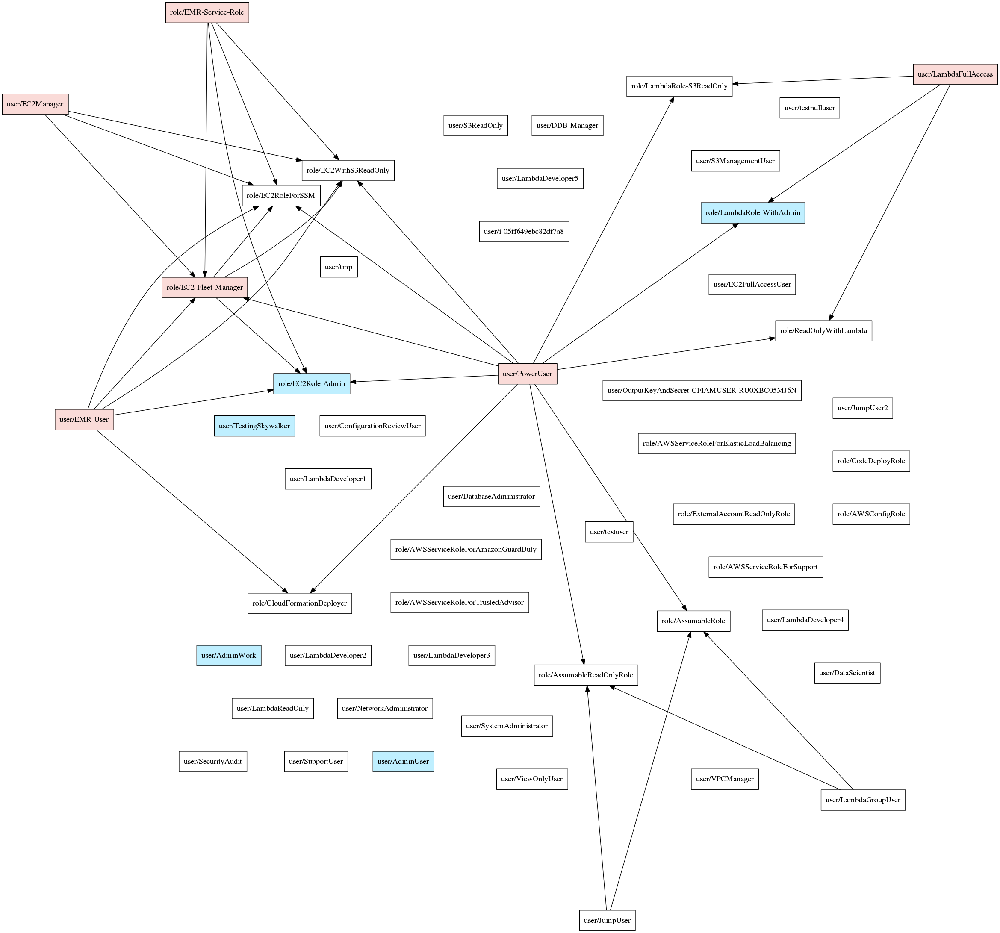
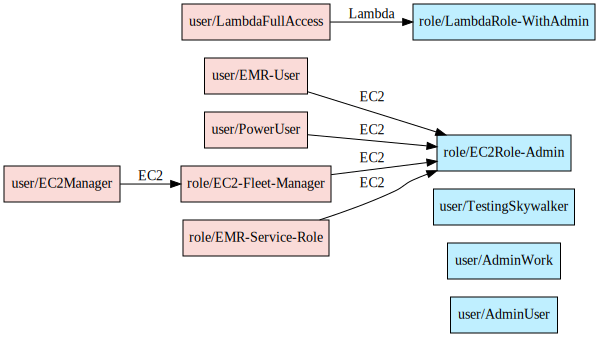

# Principal Mapper

Principal Mapper (PMapper) is a script and library for identifying risks in the configuration of AWS Identity and 
Access Management (IAM) for an AWS account or an AWS organization. It models the different IAM Users and Roles in an 
account as a directed graph, which enables checks for privilege escalation and for alternate paths an attacker could 
take to gain access to a resource or action in AWS.

PMapper includes a querying mechanism that uses a local simulation of AWS's authorization behavior. 
When running a query to determine if a principal has access to a certain action/resource, PMapper also checks if the 
user or role could access other users or roles that have access to that action/resource. This catches scenarios such as 
when a user doesn't have permission to read an S3 object, but could launch an EC2 instance that can read the S3 object.

Additional information can be found in [the project wiki](https://github.com/nccgroup/PMapper/wiki).

# Installation

## Requirements

Principal Mapper is built using the `botocore` library and Python 3.5+. Principal Mapper 
also requires `pydot` (available on `pip`), and `graphviz` (available on Windows, macOS, and Linux from 
https://graphviz.org/ ).

## Installation from Pip

~~~bash
pip install principalmapper
~~~

## Installation From Source Code

Clone the repository:

~~~bash
git clone git@github.com:nccgroup/PMapper.git
~~~

Then install with Pip:

~~~bash
cd PMapper
pip install .
~~~

## Using Docker

_(After cloning from source)_

~~~bash
cd PMapper
docker build -t $TAG .
docker run -it $TAG
~~~

You can use `-e|--env` or `--env-file` to pass the `AWS_*` environment variables for credentials when calling
`docker run ...`, or use `-v` to mount your `~/.aws/` directory and use the `AWS_CONFIG_FILE` and `AWS_SHARED_CREDENTIALS_FILE` environment variables.
The current Dockerfile should put you into a shell with `pmapper -h` ready to go as well as 
`graphviz` already installed. 

# Usage

See the [Getting Started Page](https://github.com/nccgroup/PMapper/wiki/Getting-Started) in the wiki for more information 
on how to use PMapper via command-line. There are also pages with full details on all command-line functions and 
the library code. 

Here's a quick example:

```bash
# Create a graph for the account, accessed through AWS CLI profile "skywalker"
pmapper --profile skywalker graph create
# [... graph-creation output goes here ...]

# Run a query to see who can make IAM Users
$ pmapper --profile skywalker query 'who can do iam:CreateUser'
# [... query output goes here ...]

# Run a query to see who can launch a big expensive EC2 instance, aside from "admin" users
$ pmapper --account 000000000000 argquery -s --action 'ec2:RunInstances' --condition 'ec2:InstanceType=c6gd.16xlarge'
# [... query output goes here ...]

# Run the privilege escalation preset query, skip reporting current "admin" users
$ pmapper --account 000000000000 query -s 'preset privesc *'
# [... privesc report goes here ...]

# Create an SVG representation of the admins/privescs/inter-principal access
$ pmapper --account 000000000000 visualize --filetype svg
# [... information output goes here, file created ...]
```

Note the use of `--profile`, which should behave the same as the AWS CLI. Also, later calls with 
`query`/`argquery`/`visualize` use an `--account` arg which just shortcuts around checking which account to work 
with (otherwise PMapper makes an API call to determine that).

Here's an example of the visualization:



And again when using `--only-privesc`:



# Contributions

100% welcome and appreciated. Please coordinate through [issues](https://github.com/nccgroup/PMapper/issues) before 
starting and target pull-requests at the current development branch (typically of the form `vX.Y.Z-dev`).

# License

    Copyright (c) NCC Group and Erik Steringer 2019. This file is part of Principal Mapper.

      Principal Mapper is free software: you can redistribute it and/or modify
      it under the terms of the GNU Affero General Public License as published by
      the Free Software Foundation, either version 3 of the License, or
      (at your option) any later version.

      Principal Mapper is distributed in the hope that it will be useful,
      but WITHOUT ANY WARRANTY; without even the implied warranty of
      MERCHANTABILITY or FITNESS FOR A PARTICULAR PURPOSE.  See the
      GNU Affero General Public License for more details.

      You should have received a copy of the GNU Affero General Public License
      along with Principal Mapper.  If not, see <https://www.gnu.org/licenses/>.